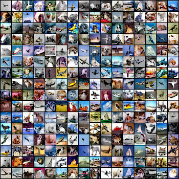

# GCR: Generator-Controller-Refiner Network for Controllable Generation

This repo contains the implementation of the class project: **Controlling DDPMs and VAEs through EBMs** by Giuseppe Concialdi

The repository has been developed starting with the fork of the [DiffuseVAE repository](https://github.com/kpandey008/DiffuseVAE) and the [LACE repository](https://github.com/NVlabs/LACE).

---
## Overview

Controlling VAE and DDP through EBMs leads to a fast, diverse and high-quality generation with a high degree of control for the synthesis.

The main contributions of this work are:

- **A novel mixed framework** that combines VAEs, DDPMs and EBMs to provide a controllable model that generates high-quality and diverse images in a reasonable amount of time leveraging the diffusion speed-quality tradeoff.

- **A modular three-stage approach** with a *generator-refiner* network and a *controller* added for improved controllability and compositionality. Each module is independent and can be replaced by other architectures.

| Conditional latent sampling | Diffusion-guided refinement  |
|:-------------: |:---------------:|
|||

---

## Code example
It is possible to try the conditional latent generation using the Colab code tutorial in the file `GCR: Latent conditional sampling.ipynb`

## Samples
All results can be accessed [here](https://drive.google.com/drive/folders/1FynpfNo702DPJEcbYadQuWozSsWmpx7S?usp=sharing).

## Contact
Giuseppe Concialdi (@Gio99c)
